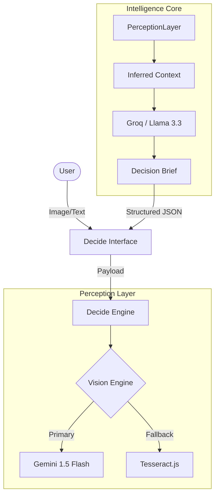

# Decide 2.0
**The Intelligence Layer for Human Choice.**

Decide is a high-performance decision distillation engine. It leverages advanced OCR and LLM reasoning to translate complex data into actionable human briefs.

## 🏗️ Architecture



- **backend/**: The Node.js "Decide Engine" (Express, Groq, Tesseract).
- **frontend/**: The React "Decide Interface" (Vite, Tailwind v4).

## 🚀 Getting Started

### 1. Engine Setup (Backend)
```bash
cd backend
npm install
npm start
```
*Engine runs on port 5002 by default.*

### 2. Interface Setup (Frontend)
```bash
cd frontend
npm install
npm run dev
```
*Interface will proxy requests to the engine.*

## 🛠️ Tech Stack
- **Reasoning**: Groq (Llama 3/Mixtral)
- **Vision**: Tesseract.js (Optimized OCR)
- **UI**: React 19 + Tailwind v4
- **Style**: Premium Humanist Design

---
*Created by Vikas Kumar.*
